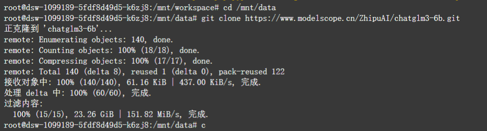

# 大语言模型本地部署与横向分析  
**人工智能导论第四次作业**  

---

## 目录  
1. [本地部署](#本地部署)  
2. [问答测试](#问答测试)  
3. [横向分析](#横向分析)  
4. [模型优缺点总结](#模型优缺点总结)  
5. [截图说明](#截图说明)  

---

## 本地部署  
成功配置魔搭社区服务器环境后，使用 `git clone` 命令部署本地大模型。  

### 部署模型  
1. **智谱AI ChatGLM3-6B 模型**  
   - 截图：  
2. **通义千问 Qwen-7B-Chat 模型**  
   - 截图：`media/image2.png`  

---

## 问答测试  
测试问题旨在检测模型对文字语义的理解能力。  

### 测试问题  
1. 请说出以下两句话区别在哪里？  
   - 冬天：能穿多少穿多少  
   - 夏天：能穿多少穿多少  
2. 请说出以下两句话区别在哪里？  
   - 单身狗产生的原因有两个，一是谁都看不上，二是谁都看不上  
3. 他知道我知道你知道他不知道吗？这句话里，到底谁不知道？  
4. 从不同的角度思考，1+1等于几？  
5. 分析对话中“意思”的不同含义（见原文示例）。  

### 回答截图  
- **Qwen-7B-Chat**：`media/image3.png`、`media/image4.png`、`media/image5.png`  
- **ChatGLM3-6B**：`media/image6.png`、`media/image7.png`  

---

## 横向分析  
### 1. 语言流畅性和可读性  
- **ChatGLM3-6B**：输出正式、条理清晰，提供详细解释，适合严谨场景。  
- **Qwen-7B-Chat**：语言直接、口语化，回答简洁直观。  

### 2. 文本理解能力  
- **ChatGLM3-6B**：擅长汉语语境和多层次逻辑推理（如双关语、语义嵌套）。  
- **Qwen-7B-Chat**：对复杂语义（如问题5）理解较弱，可能直接回复“不理解”。  

### 3. 多维度思考能力  
- **ChatGLM3-6B**：依赖固定知识框架（如严格数学规则），缺乏跨领域联想。  
- **Qwen-7B-Chat**：善于结合不同领域（如数学与量子力学）提供多样化视角。  

### 4. 回答一致性和逻辑性  
- **ChatGLM3-6B**：逻辑连贯，分点分析清晰。  
- **Qwen-7B-Chat**：简洁但可能简化复杂逻辑链条，深度不足。  

---

## 模型优缺点总结  
### ChatGLM3-6B  
- **优点**  
  1. 语言流畅，条理清晰，适合严谨场景。  
  2. 对复杂汉语语义理解能力强。  
  3. 逻辑一致性高。  
- **不足**  
  1. 缺乏多维度创造力。  
  2. 表达过于正式，灵活性不足。  

### Qwen-7B-Chat  
- **优点**  
  1. 多维度思考能力突出。  
  2. 回答简洁，适合快速获取信息。  
- **不足**  
  1. 复杂语义理解能力弱。  
  2. 逻辑深度和严谨性不足。  

---

## 截图说明  
- 所有截图存放于 `media/` 目录，命名格式为 `imageX.png`。  
- 截图内容包含模型部署过程及问答测试结果。  

---  
**注**：本实验基于魔搭社区服务器环境完成，模型回答可能存在场景局限性。  
